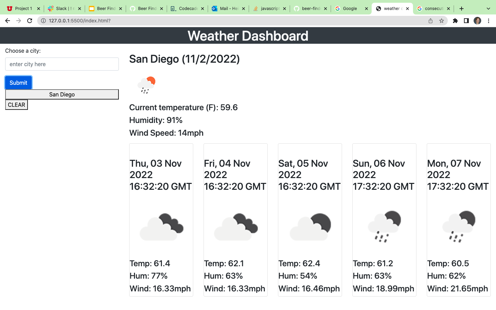

# weather-dashboard
In this challenge, I built a weather dashboard that will run in the browser and feature dynamically updated HTML and CSS.

## User Story
As a user wanting to find the weather forecast for several locations, I want to use an app that shows me the forecast of the current day of one location, as well as that of the next five consecutive days. I want to compare the forecast of several previously searched locations. 


## Acceptance Criteria

```
GIVEN a weather dashboard with form inputs
WHEN I search for a city
THEN I am presented with current and future conditions for that city and that city is added to the search history
WHEN I view current weather conditions for that city
THEN I am presented with the city name, the date, an icon representation of weather conditions, the temperature, the humidity, and the wind speed
WHEN I view future weather conditions for that city
THEN I am presented with a 5-day forecast that displays the date, an icon representation of weather conditions, the temperature, the wind speed, and the humidity
WHEN I click on a city in the search history
THEN I am again presented with current and future conditions for that city
```

## Installation 

N/A

## Usage
- Input your city and click "submit".
- Current weather conditions and forecast of the next five days will be applied.
- The searched city will be saved as a button on the screen. Click on it to repeat search. 

## Mock-Up




## License 
MIT

## Credits
N/A